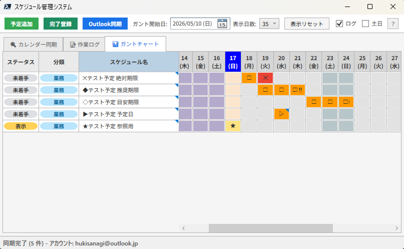

# PowerShell Outlook Ganttchart

Outlook の予定を取得し、作業ログと合わせてガントチャート表示する PowerShell/WPF アプリ。



## 開発

開発時は分割された `src/` 配下のファイルを使う。

```powershell
.\run-dev.ps1
```

開発実行時の `schedules.json` / `logs.json` はリポジトリルートを基準に読む。

分類を調整したい場合は、リポジトリルートまたは単一ファイルと同じフォルダの `categories.json` を編集する。
未配置の場合は、初回読み込み時に内蔵の既定分類から自動生成する。

```json
[
  { "name": "業務", "background": "#BAE6FD", "foreground": "#0369A1" },
  { "name": "調査", "background": "#E9D5FF", "foreground": "#6B21A8" }
]
```

チェックボックスや初期表示は、同じ場所の `settings.json` を編集する。
未配置の場合は、初回読み込み時に内蔵の既定値から自動生成する。

```json
{
  "ganttDefaultDays": 35,
  "ganttStartOffsetDays": -7,
  "logInputModeDefault": true,
  "suppressWeekendScheduleHighlightDefault": false,
  "addAppointmentPrivateDefault": true,
  "addAppointmentShowAsFreeDefault": true,
  "addAppointmentTypeDefaultSymbol": "◆",
  "addAppointmentCategoryDefault": "業務",
  "rememberWindowPlacement": true,
  "windowWidth": 769,
  "windowHeight": 600,
  "windowMinWidth": 825,
  "windowMinHeight": 420,
  "windowLeft": null,
  "windowTop": null,
  "fontMain": "Noto Sans JP, Meiryo, Yu Gothic UI",
  "fontGantt": "Yu Gothic",
  "fontSizeMain": 11,
  "fontSizeDialog": 11,
  "fontSizeGantt": 11
}
```

## 単一ファイル生成

会社PCなどへコピペで持っていく場合は、単一ファイルを生成する。

```powershell
.\build.ps1
```

既定では `dist/OutlookGantt.ps1` を生成する。
生成物の先頭には、元になったGitコミットIDをコメントとして入れる。

ルートの `OutlookGantt.ps1` を更新したい場合は、出力先を指定する。

```powershell
.\build.ps1 -OutputPath .\OutlookGantt.ps1
```

## テスト

UIやOutlook実体を起動しない範囲の軽いロジック確認を行う。

```powershell
.\test.ps1
```

構文確認、軽量テスト、単一ファイル生成、生成物の構文確認をまとめて行う。

```powershell
.\verify.ps1
```

## 構成

- `src/App/`: イベント登録、画面更新、イベントハンドラ。
- `src/Config/`: データファイルパス、Outlook対象、色、列幅、フォント。
- `src/Content/`: アプリ内ヘルプ本文。
- `src/Domain/`: タイトル解析、作業ログ編集/表示、ガント判定、ガントDataView生成。
- `src/Infrastructure/`: JSON読み書き、Outlook COM連携。
- `src/UI/`: WPFメイン画面、ダイアログ、Gridレイアウト、ガント列テンプレート。
- `src/Shared/`: 汎用関数。

`OutlookGantt.ps1` は持ち出し用の単一ファイルとして扱い、通常の編集は `src/` 側で行う。

## 現在の扱い

リファクタ第一段階では、巨大な `src/UI/MainWindow.ps1` はまだXAML置き場として残している。
ここを `.xaml` ファイルへ分けるかは、実画面確認後に判断する。
